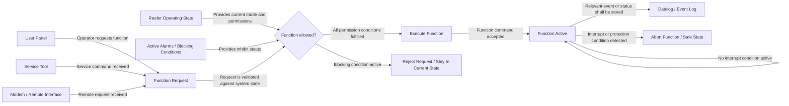

**Specification Rewrite Template for Container Refrigeration System Requirements**
Version: 1.1  
Document owner: Ajdin Kovacevic  
Controlled location: [Requirement Writing Template - EaseReq](https://mcicontainers.atlassian.net/projects/CSI?selectedItem=com.atlassian.plugins.atlassian-connect-plugin:com.easesolutions.jira.plugins.requirements__requirements-project-page-default#!tree?issueKey=CSI-2394)  
Last updated: 22/06/2026  

## Version History

| **Version** | **Date** | **Author** | **Change description** |
|---|---|---|---|
| **1.0** | 22/06/2026 | **Ajdin Kovacevic** | **Initial template for rewriting existing requirements into developer-readable specifications.** |
| **1.1** | 22/06/2026 | **Ajdin Kovacevic** | **Removed Specification ID section/table. Added coworker usage instruction and Copilot rewrite instruction for using the Word file as the controlled template reference.** |

## Coworker Usage Instruction

Use this file as the controlled template reference when asking Copilot to rewrite existing partner-company or legacy requirement specifications.

**Recommended Copilot prompt:**

Use the attached Specification Rewrite Template as the mandatory format.  
Rewrite the requirement below into that template.  
Preserve the technical meaning.  
Generate missing sections where possible.  
Mark unclear or inferred behavior under Assumptions / Open Points.  
Use Container Refrigeration System context.  

**Requirement:**  
[paste requirement text here]

Do not ask Copilot to create a blank template unless that is explicitly needed. The normal workflow is to paste an existing requirement and rewrite it into the template style.

## Copilot Rewrite Instruction

When this document is attached to a Copilot chat together with an existing requirement specification, use this document as the mandatory rewrite format.  
Do not summarize the requirement only.  
Do not create a blank template unless explicitly requested.  
Rewrite the provided requirement into the specification format defined in this document.  
Preserve the original technical meaning.  
Generate missing sections where possible from the provided requirement text.  
If behavior is unclear, incomplete, inferred, or not safely derivable, state it under **Assumptions / Open Points**.  
Assume the requirement belongs to a Container Refrigeration System, similar to an MCI / SCI Cooling Reefer system.  
Use normal text only. Do not use heading-size formatting. Use **bold normal text** for section titles.  
Generate diagrams with labelled arrows where diagrams improve understanding.  
Generate a Fit Criterion table and a Test Specification table.  
Produce only the rewritten specification unless the user asks for explanation.

## Purpose

This template shall be used to rewrite already existing partner-company or legacy requirement specifications into a consistent, developer-readable software specification format.

The input may be a complete requirement specification or only a short functional description. The rewritten output shall still follow this template as far as possible.

If information is missing, the missing sections shall be generated from the available requirement content where technically reasonable. If behavior is unclear or cannot be derived safely, it shall be listed under **Assumptions / Open Points**.

The system context is a Container Refrigeration System, similar to an MCI / SCI Cooling Reefer system.

The rewritten specification shall be written with reefer software behavior in mind, including:

- refrigeration control
- cooling, heating, defrost, idle, and protection modes
- compressor, evaporator fan, condenser fan, heaters, valves, sensors, and actuators
- alarms, warnings, events, and datalogging
- user panel, service tool, app, modem, and remote interfaces
- operating modes, permissions, blocking conditions, and fallback behavior
- state-machine behavior and service/diagnostic workflows

The goal is to make each rewritten specification:

- understandable for software developers
- testable by verification teams
- consistent across all rewritten specifications
- explicit about expected software behavior
- traceable from requirement to test
- suitable for a container refrigeration controller context

All section titles shall use normal text with bold formatting only. Do not use heading-size formatting.

---

**<Specification Title>**

**1. Specification / Integrator Spec**

**Specification**  
<Rewrite the original requirement into clear, developer-readable software behavior.>

The specification shall explain what the software shall do based on the provided requirement text. The rewritten specification shall preserve the original technical meaning but improve clarity for software developers and testers.

The specification should describe, where relevant:

- what function or behavior is required
- which reefer controller function, module, or component is responsible
- which inputs, signals, requests, sensors, interfaces, or states influence the behavior
- what the software shall do when the behavior is allowed
- what the software shall do when the behavior is not allowed
- what the fallback or default behavior is
- what priority rules apply if multiple functions or requests interact
- which conditions are invalid, unavailable, ignored, blocked, or rejected
- what shall be logged, alarmed, displayed, stored, or communicated
- how the behavior affects the reefer system state, cargo protection, diagnostics, or service workflow

Use **shall** for mandatory software behavior. Use **shall not** for prohibited software behavior. Use **may** only for optional behavior.

Avoid vague wording such as:

- works correctly
- handles properly
- as expected
- normal behavior
- suitable response
- appropriate action

**Background / System Context**  
<Explain the system knowledge needed to understand the requirement.>

This section shall place the requirement into the context of a container refrigeration system.

Include relevant information such as:

- involved reefer system components
- sensor or signal origin
- actuator or function controlled by the software
- operating mode dependency
- communication interface dependency
- state-machine interaction
- timing constraints
- cargo protection or equipment protection purpose
- alarm, warning, event, or datalogging interaction
- service tool, user panel, app, modem, or remote monitoring interaction

If the source requirement does not explicitly describe the system context, generate a reasonable context from the available functional behavior and mark uncertain parts under **Assumptions / Open Points**.

**Why**  
<Explain why the behavior exists.>

The explanation shall describe the engineering reason behind the requirement. The explanation should clarify why the behavior matters for the container refrigeration system, for example:

- protecting cargo
- protecting equipment
- avoiding invalid control states
- ensuring correct diagnostics
- ensuring traceability in logs
- preventing misleading service data
- ensuring safe fallback behavior
- avoiding unnecessary alarms or unstable operation

**Functional Behavior**

Write the functional behavior as clear software-facing shall-statements. Use bullets where possible.

- The software shall <required behavior 1>.
- The software shall <required behavior 2>.
- If <condition>, the software shall <result>.
- If <condition is not fulfilled>, the software shall <fallback or blocked behavior>.
- If <signal/input/state> is invalid or unavailable, the software shall <default behavior>.
- If multiple requests are active, the software shall <priority behavior>.
- If relevant, the software shall log <event/alarm/warning/data> in <datalog/service log/event log>.
- If relevant, the software shall expose <status/result/error> to <user panel/service tool/app/modem/interface>.
- If relevant, the software shall transition from <state> to <state> when <condition> occurs.

**Related Requirements**

| **Requirement ID** | **Relation** |
|---|---|
| **<REQ-ID or Unknown>** | **<Describe relation to this specification>** |
| **<REQ-ID or Unknown>** | **<Describe relation to this specification>** |

If no related requirements are provided or can be identified, write: **No related requirements identified.**

**Limitations**  
<Describe known limitations, constraints, or excluded behavior.>

Examples:

- The software shall not allow <invalid behavior>.
- This specification does not define <excluded functionality>.
- <Specific behavior> is handled by <related requirement ID>.
- This requirement does not define mechanical behavior of <component>, only software control and monitoring behavior.
- This requirement does not define alarm reaction behavior unless explicitly stated.

**Assumptions / Open Points**

Use this section when the original requirement is unclear, incomplete, or only partially defines the behavior. Do not silently invent critical behavior. If the source specification does not provide enough information, state the uncertainty explicitly.

| **Item** | **Description** |
|---|---|
| **Assumption-1** | **<State assumption made while rewriting>** |
| **Assumption-2** | **<State assumption made while rewriting>** |
| **Open-Point-1** | **<State what needs clarification>** |
| **Open-Point-2** | **<State what needs clarification>** |

---

**2. Diagrams**

Use diagrams when they simplify the explanation. Diagrams shall be developer-readable, not decorative. Diagrams shall be generated from the provided requirement information where possible, even if the original requirement did not contain diagrams.

The preferred diagram structure is:

- request sources, input signals, sensors, or external triggers on the left
- decision logic, guard conditions, validation logic, priority handling, or state checks in the middle
- software behavior, state-machine behavior, actuator command, event logging, alarm behavior, or output on the right

Diagram arrows shall include short text labels explaining what the flow represents. Arrow labels shall describe trigger, request, condition, validation, action, result, fallback, rejection reason, state transition, logged event, or interface response. Avoid empty arrows unless the relationship is completely obvious.

**Diagram Example**

**Diagram Guidelines**  
show both allowed and not-allowed paths  
show invalid or unavailable signal behavior if relevant  
show interrupt paths where relevant  
show fallback behavior where relevant  
show priority handling where relevant  
show event, warning, alarm, or datalogging behavior where relevant  
show interface feedback where relevant  
use short and functional arrow labels  
avoid overloading one diagram with too many details  
split complex behavior into several diagrams if needed  

**3. Fit Criterion**  
The fit criterions define what the software must achieve for the specification to be approved. Fit criterions shall be generated from the rewritten specification, even if the original requirement does not contain fit criterions.  
Each fit criterion shall be short, testable, unambiguous, written as one approval condition, and traceable to one or more test cases. Use table format.

<table>
<tr>
<th>

**FIT#**

</th>
<th>

**FIT-Criterion**

</th>
</tr>
<tr>
<td>

**FIT-1**

</td>
<td>

**The software shall <specific required behavior>.**

</td>
</tr>
<tr>
<td>

**FIT-2**

</td>
<td>

**The software shall <specific required behavior>.**

</td>
</tr>
<tr>
<td>

**FIT-3**

</td>
<td>

**The software shall <specific required behavior>.**

</td>
</tr>
<tr>
<td>

**FIT-4**

</td>
<td>

**The software shall <specific required behavior>.**

</td>
</tr>
</table>

**Fit Criterion Writing Rules**  
Good examples:

<table>
<tr>
<th>

**FIT#**

</th>
<th>

**FIT-Criterion**

</th>
</tr>
<tr>
<td>

**FIT-1**

</td>
<td>

**The software shall block the compressor start request when the required pressure sensor value is invalid.**

</td>
</tr>
<tr>
<td>

**FIT-2**

</td>
<td>

**The software shall log the defined event in the datalog when the function changes state.**

</td>
</tr>
<tr>
<td>

**FIT-3**

</td>
<td>

**The software shall transition from Active to Safe State within 500 ms after the interrupt condition becomes active.**

</td>
</tr>
</table>

Poor examples:

<table>
<tr>
<th>

**FIT#**

</th>
<th>

**FIT-Criterion**

</th>
</tr>
<tr>
<td>

**FIT-1**

</td>
<td>

**The software shall work correctly.**

</td>
</tr>
<tr>
<td>

**FIT-2**

</td>
<td>

**The software shall handle the error properly.**

</td>
</tr>
<tr>
<td>

**FIT-3**

</td>
<td>

**The software shall behave normally.**

</td>
</tr>
</table>

**4. Test Specification**  
The test specification shall describe how each fit criterion is verified. Test specifications shall be generated from the rewritten requirement and fit criterions, even if the original requirement does not contain tests.  
Each test case shall include test case ID, test name, related fit criterion, setup / preconditions, action / stimulus, and expected result. Expected results shall be explicit and shall map back to the related fit criterion.  
Test descriptions shall be written with the Container Refrigeration System context in mind.  
Where relevant, test setup shall include:  
reefer controller mode  
operating state or state-machine state  
sensor values  
actuator availability  
active/inactive alarms  
communication source  
user panel state  
service tool connection  
modem/app/remote interface state  
datalogging status  
configured parameters  
invalid/unavailable signal conditions  

<table>
<tr>
<th>

**Test Case**

</th>
<th>

**Test description**

</th>
</tr>
<tr>
<td>

**TC-1: <Test name>**

</td>
<td>

**Related fit criterion: FIT-1**

Setup:
- <Initial reefer controller condition>
- <Relevant sensor/signal/state setup>
- <Relevant interface setup, e.g. User Panel, Service Tool, Modem>

Action:
- <Trigger or input change>

Expected result:
- **The software shall <expected result mapped to FIT-1>.**

</td>
</tr>
<tr>
<td>

**TC-2: <Test name>**

</td>
<td>

**Related fit criterion: FIT-2**

Setup:
- <Initial reefer controller condition>
- <Relevant sensor/signal/state setup>

Action:
- <Trigger or input change>

Expected result:
- **The software shall <expected result mapped to FIT-2>.**

</td>
</tr>
<tr>
<td>

**TC-3: <Test name>**

</td>
<td>

**Related fit criterion: FIT-3**

Setup:
- <Initial reefer controller condition>
- <Relevant sensor/signal/state setup>

Action:
- <Trigger or input change>

Expected result:
- **The software shall <expected result mapped to FIT-3>.**

</td>
</tr>
</table>

**Rewrite Rules**  

**Input Handling**  
When rewriting an existing specification:  
preserve the original technical meaning  
rewrite unclear text into developer-readable software behavior  
generate missing template sections where possible  
generate diagrams where they improve understanding  
generate fit criterions from the rewritten behavior  
generate test specifications from the fit criterions  
use the container refrigeration system context  
do not silently invent critical behavior  
place uncertain or inferred behavior under Assumptions / Open Points  
If the original requirement only contains a functional description, still generate Specification, Background / System Context, Why, Functional Behavior, Related Requirements, Limitations, Assumptions / Open Points, Diagrams, Fit Criterion, and Test Specification.  

**General Writing Rules**  
Use active voice.  
Use shall for mandatory software behavior.  
Use shall not for prohibited software behavior.  
Use may only for optional behavior.  
Avoid vague wording.  
Do not copy ambiguous partner-company text without interpretation.  
Preserve the original technical meaning.  
State assumptions when the original text is unclear.  
Keep each fit criterion independently testable.  
Ensure every fit criterion has at least one test case.  
Ensure every test case has a clear expected result.  
Use normal text style only.  
Do not use heading-size formatting.  
Use bold normal text for section titles.  
Write the specification as part of a Container Refrigeration System unless clearly stated otherwise.  

**Diagram Rules**  
Use diagrams where they improve understanding.  
Use request sources, input signals, or sensors on the left.  
Use decision, validation, guard logic, or priority handling in the middle.  
Use software behavior, state-machine behavior, actuator command, event logging, alarm behavior, or output on the right.  
Add short text labels to arrows.  
Arrow labels shall explain the flow, condition, trigger, action, result, rejection, fallback, or transition.  
Show rejected, fallback, and interrupt paths where relevant.  
Show datalogging, event, warning, and alarm paths where relevant.  
Keep diagrams simple enough for developers to read without guesswork.  

**Fit Criterion Rules**  
Use table format.  
Use FIT-1, FIT-2, FIT-3, etc. in the left column.  
State what the software shall do in the right column.  
Write one approval condition per row.  
Avoid combining unrelated behavior into one fit criterion.  
Avoid vague approval conditions.  

**Test Specification Rules**  
Use table format.  
Each test case shall reference one or more fit criterions.  
Each test case shall include setup, action, and expected result.  
Expected results shall be bold.  
Expected results shall be observable or verifiable.  
Test descriptions shall reflect the Container Refrigeration System context.  
Include relevant reefer setup conditions where applicable, such as operating mode, sensor values, alarms, actuator states, interface source, and datalogging state.  
Do not write test cases that only say verify correct behavior.  

**Minimum Quality Checklist**  
☐ The original technical meaning is preserved.  
☐ Missing fields have been generated where possible.  
☐ Unclear or inferred behavior is listed under Assumptions / Open Points.  
☐ The specification explains what the software shall do.  
☐ The system context is understandable without reading the partner specification.  
☐ The requirement is written in the context of a Container Refrigeration System.  
☐ The reason for the behavior is described.  
☐ Preconditions and blocking conditions are described.  
☐ Invalid or unavailable signal behavior is described, if relevant.  
☐ Priority rules are described, if relevant.  
☐ Datalogging, alarms, warnings, or events are described, if relevant.  
☐ Interfaces such as user panel, service tool, app, modem, or remote monitoring are described, if relevant.  
☐ A diagram is included when it improves understanding.  
☐ Diagram arrows include explanatory text labels.  
☐ Fit criterions are written in table format.  
☐ Fit criterions are labelled FIT-1, FIT-2, etc.  
☐ Each fit criterion is testable.  
☐ The test specification maps test cases to fit criterions.  
☐ Test setup uses reefer-relevant setup conditions where applicable.  
☐ Expected results are explicit and bolded.  
☐ No heading-size formatting is used.  
☐ Section titles use normal text with bold formatting only.
